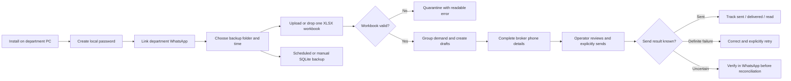

# Broker Demand Desk

Broker Demand Desk is a self-contained Windows application that converts a daily broker-demand Excel workbook into reviewed WhatsApp message drafts. It is designed for independent departmental installations: every PC keeps its own database, password, WhatsApp Web profile, backup schedule and configuration.

> Messages are never sent automatically. An operator must review the generated drafts and explicitly choose **Send**, **Send selected**, or **Send all drafts**.

## Current release

| Item | Value |
| --- | --- |
| Version | `1.2.5` |
| Installer | [`installer/output/BrokerDemandDesk-Setup-1.2.5.exe`](installer/output/BrokerDemandDesk-Setup-1.2.5.exe) |
| SHA-256 | `1C90E738D174E92AE0B21318BDA223B8D5690A42641C1D24813B79A439E4FDF3` |
| Platform | Windows 10/11 x64 |
| Runtime | Bundled Node.js and Chromium; no separate Node, Docker or database installation required |
| Test status | 58 automated tests passing, plus desktop/mobile browser verification |

The installer is not currently code-signed, so Windows can display an **Unknown Publisher** warning. Verify the SHA-256 checksum before distribution.

## What it does

- Imports exactly one `.xlsx` workbook at a time.
- Validates the Excel/ZIP structure and required business columns before creating drafts.
- Groups demand rows by broker and party.
- Maintains a local broker-to-phone-number directory.
- Creates editable message drafts; nothing leaves the PC without operator approval.
- Sends text and approved local attachments through the linked WhatsApp Web account.
- Tracks draft, sending, sent, delivered, read, failed and uncertain-delivery states.
- Supports phone-code and QR linking, including switching and refresh controls.
- Supports password reset through the already-linked department WhatsApp account.
- Creates independent scheduled database backups using `year/month` folders.
- Lets every PC choose its own daily backup time.
- Includes safe restart/watchdog behavior and persistent browser login sessions.

## End-to-end product flow



## Registered feature-flow index

Every supported operational flow is assigned a stable identifier and documented in the [Feature Flow Registry](docs/FEATURE_FLOWS.md). The registry records the trigger, prerequisites, processing sequence, success state, failure/recovery behavior and data affected by each feature.

| Area | Registered flows |
| --- | --- |
| Installation and lifecycle | `LIFE-001` to `LIFE-004` |
| Authentication and recovery | `AUTH-001` to `AUTH-005` |
| WhatsApp connection | `WA-001` to `WA-006` |
| Workbook import | `IMP-001` to `IMP-004` |
| Broker and draft management | `DRAFT-001` to `DRAFT-003` |
| Sending and delivery safety | `SEND-001` to `SEND-006` |
| Backups | `BACKUP-001` to `BACKUP-005` |
| Interface and diagnostics | `UI-001` to `UI-004` |

The registry is the source of truth for acceptance testing and future changes. A feature is not considered complete until its flow, failure behavior and persistence boundary are represented there.

## Independence between departments

Each installation stores its operational state below its own installation directory. It does not use a shared cloud database or a machine-wide WhatsApp profile.

The following remain local to that PC:

- Application password and authenticated browser sessions.
- Embedded SQLite database and broker directory.
- WhatsApp Web `LocalAuth` profile.
- Incoming, processed and failed workbook folders.
- Attachments.
- Selected backup folder and daily backup time.
- Runtime and watchdog logs.

Do not copy the installed `data` directory between departments. Distribute only the installer unless an intentional migration has been planned.

## Installation

1. Copy `BrokerDemandDesk-Setup-1.2.5.exe` to the target Windows PC.
2. Optionally verify its SHA-256 checksum:

   ```powershell
   Get-FileHash .\BrokerDemandDesk-Setup-1.2.5.exe -Algorithm SHA256
   ```

3. Run the installer. It installs per user and normally does not require administrator privileges.
4. Open **Broker Demand Desk** from the Start menu or desktop shortcut.
5. Create a password of at least eight characters.
6. Link the department's WhatsApp number using a phone code or QR code.
7. Choose a backup folder and select that PC's preferred daily backup time.

### Updating an existing installation

Run the newer installer directly over the existing installation. Do **not** uninstall first. The upgrade replaces application/runtime files while preserving the local database, WhatsApp profile, password, backup configuration, workbooks and attachments.

### Uninstalling

Use either:

- **Settings → Apps → Installed apps → Broker Demand Desk → Uninstall**, or
- **Uninstall Broker Demand Desk** from the Start menu.

The uninstaller intentionally preserves operational data folders to avoid accidental loss. Remove retained data manually only after confirming that backups are valid and the department no longer needs the installation.

## Daily workflow

1. Prepare an `.xlsx` workbook using the required headers.
2. Upload it through **Manual Upload**, or place it in the installation's `incoming` folder.
3. Review rows marked **Needs info** and supply missing broker phone numbers.
4. Open each draft and verify its message, party, broker, phone number and attachment.
5. Send an individual draft or select multiple approved drafts.
6. Review delivery indicators and resolve any **Verify first** items manually in WhatsApp before considering a retry.

### Required workbook headers

The importer expects these columns:

```text
Invoice No.
Demand Date
Party Name
StoneId
ReportNo.
Color
Clarity
CTS
Broker Name
Broker Contact Number
Buyer Name
Attachment
```

Legacy `.xls`, renamed non-Excel files, malformed workbooks, header-only files and rows missing essential business values are rejected safely. Failed inputs are retained with a readable error sidecar when possible.

## Backups

Backups are local and independent per PC.

1. Choose a writable folder from the **Daily Backup** card.
2. Select a time under **Daily time on this PC** and choose **Save time**.
3. The app immediately creates a baseline after the first folder selection.
4. Scheduled backups are stored as:

   ```text
   <selected folder>/YYYY/MM/broker-demand-YYYY-MM-DD.db
   ```

5. A failed scheduled backup retries after 15 minutes.
6. **Back up now** creates an additional timestamped manual snapshot.

The native Windows folder chooser is owned by the application and opens in the foreground.

## Login and recovery

- Dashboard authentication uses a rolling 30-minute idle timeout.
- Authenticated sessions are persisted in the installation's SQLite database, so a watchdog/server restart does not immediately log out the browser.
- Explicit logout, password changes and successful password recovery invalidate existing sessions.
- Password recovery is available only when the installation's own WhatsApp profile is linked, ready and internally consistent.
- Recovery codes are short-lived, one-time, attempt-limited and never stored in plain text.

## Send safety

- A message row is atomically claimed before handing it to WhatsApp.
- Concurrent requests cannot send the same row twice.
- A sent row cannot be sent again.
- If the app stops after handing a message to WhatsApp but before confirmation, the row becomes `send_uncertain`.
- `send_uncertain` is never retried automatically. The operator must verify the conversation in WhatsApp and explicitly reconcile it.
- Malformed WhatsApp acknowledgement events and known transient Puppeteer navigation races are contained so they cannot restart the entire application.

## Development

### Requirements

- Node.js 24 x64 is recommended for parity with the bundled release runtime.
- npm.
- Windows is required for installer compilation and the native folder picker.
- Inno Setup 6 for producing the installer.

### Install and run

```powershell
cd app
npm install
npm start
```

Open `http://127.0.0.1:4173`.

### Test

```powershell
cd app
npm test
```

The suite covers authentication recovery, persistent sessions, Excel validation, multipart upload limits, backup scheduling, attachment policy, runtime logging, send idempotency, uncertain delivery handling, WhatsApp setup/refresh recovery and installer exclusions.

### Build the self-contained installer

The build machine must have the private bundled runtime assets under `installer/runtime/`. They are deliberately excluded from Git because the compiled release installer already contains them and they are large generated dependencies.

```powershell
cd installer
.\build.ps1
```

The build script:

1. Verifies version consistency.
2. Verifies bundled Node and Chromium.
3. Runs all release tests using the bundled Node runtime.
4. Compiles the Inno Setup installer.
5. Checks the Windows product version.
6. Verifies signing when configured.
7. Writes a SHA-256 checksum file.

For signing configuration, see the comments at the top of [`installer/build.ps1`](installer/build.ps1).

## Repository structure

```text
app/
  public/                 Browser dashboard
  src/                    Server, database, import, backup and providers
  test/                   Automated regression tests
  start.ps1 / stop.ps1    Windows watchdog lifecycle
installer/
  build.ps1               Verified release build
  setup.iss               Inno Setup definition
  output/                 Current LFS-managed installer and checksum
docs/
  ARCHITECTURE.md          Components, data flow and safety boundaries
  FEATURE_FLOWS.md         Registered feature and recovery flows
  OPERATIONS.md            Deployment and support runbook
CHANGELOG.md               Release history
```

## Security and privacy

- The HTTP server binds to `127.0.0.1` by default.
- Runtime secrets, databases, WhatsApp profile files, logs and workbooks are excluded from this repository.
- Upload names are sanitized and imports are size/type constrained.
- Attachment paths are restricted to the installation's attachment directory and approved file types.
- Diagnostic logging redacts common credentials, tokens, QR data and session identifiers.

WhatsApp Web automation is based on the unofficial `whatsapp-web.js` integration and is not the official Meta Cloud API. Organisations requiring an officially supported channel should evaluate the included Cloud API provider and Meta's current business messaging requirements before production use.

## Additional documentation

- [Architecture](docs/ARCHITECTURE.md)
- [Feature Flow Registry](docs/FEATURE_FLOWS.md)
- [Operations and troubleshooting](docs/OPERATIONS.md)
- [Release history](CHANGELOG.md)
